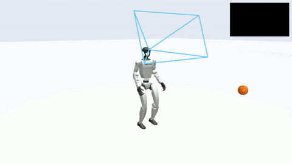
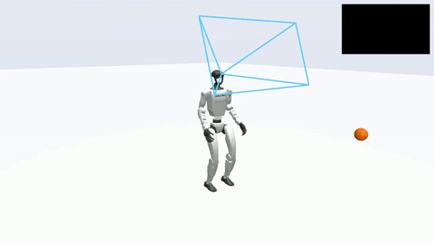
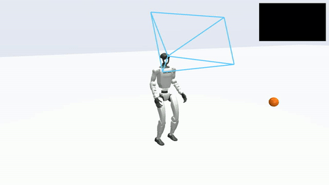
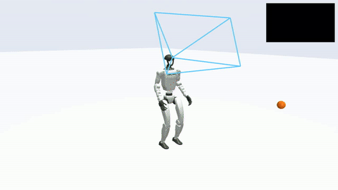
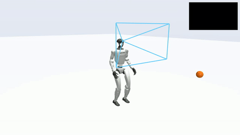

# PAC-MAN: Perception-Aware CBF-RL for Whole-Body Safety in Humanoid Dodgeball

Lizhi Yang, Junheng Li, Aaron D. Ames — Caltech AMBER Lab, 2026

[[Website]](https://lzyang2000.github.io/perceptive_cbf_rl/)
[[arXiv]](https://arxiv.org/abs/2607.28623)
[[Paper]](https://arxiv.org/pdf/2607.28623)
[[Video]](https://youtu.be/Dcq5RWf62fw)
[[Live demo]](https://lzyang2000.github.io/perceptive_cbf_rl/demo/)

Training pipeline, benchmark, and hardware deployment stack for PAC-MAN: a Unitree G1
humanoid that dodges thrown balls using only a head-mounted depth camera, trained
with control-barrier-function (CBF) safety rewards and an adversarial motion prior
(AMP), and deployed zero-shot on hardware (19/20 hand throws dodged, 0 falls).

The perceptive policy sees ball-only masked depth (16x9, sparse frame stack), the
representation an EfficientTAM ball segmenter produces on the real robot, so the
sim-to-real gap collapses to the perception layer. Safety is shaped at training
time by whole-body barriers: a per-link clearance CBF reward (Link-CBF, the
deployed configuration) and a joint-space CBF module used as reward guidance
(Joint-CBF), with an optional privileged runtime projection (+filter) as a
simulation ceiling.

Built on [mjlab](https://github.com/mujocolab/mjlab) (MuJoCo Warp) with the AMP
implementation adapted from [AMP_mjlab](https://github.com/ccrpRepo/AMP_mjlab),
PPO from [rsl_rl](https://github.com/leggedrobotics/rsl_rl).

<p align="center"></p>

### Emergent dodge modes

<table>
  <tr>
    <td align="center"><br/><sub>duck</sub></td>
    <td align="center"><br/><sub>sidestep left</sub></td>
    <td align="center"><br/><sub>sidestep right</sub></td>
  </tr>
</table>

### Same throw, different policy

The barrier reward and the perception regime each decide hits on identical seeded throws
(bottom row: both policies are trained with the Joint-CBF reward and differ only in perception):

<table>
  <tr>
    <td align="center"><br/><sub>core distance reward only: hit</sub></td>
    <td align="center"><br/><sub>Link-CBF reward: dodged</sub></td>
  </tr>
  <tr>
    <td align="center"><br/><sub>fixed camera + Joint-CBF: hit</sub></td>
    <td align="center"><br/><sub>gimbal camera + Joint-CBF: dodged</sub></td>
  </tr>
</table>

## Repository layout

| Path | Contents |
|---|---|
| `src/tasks/amp_loco/` | Envs, rewards, CBF terms, AMP runner (mjlab manager-based tasks) |
| `src/assets/` | G1 model (MJCF + meshes), retargeted AMP motion clips |
| `scripts/` | `train.py`, `play.py`, `dodge_benchmark.py`, motion retargeting tools |
| `train_runs/` | One launcher per paper experiment cell (see its README) |
| `deploy/` | Hardware stack: ZED + EfficientTAM + ONNX policy + Unitree DDS (see its README) |
| `tests/` | Pytest suite for the CBF terms, omni throws, gimbal aim |

## Setup

Requires Linux x86_64, an NVIDIA GPU, and [uv](https://docs.astral.sh/uv/).

```bash
git clone <this-repo> && cd perceptive_cbf_rl
uv sync                       # provisions Python 3.11 + mjlab + torch (cu128)
uv run python scripts/list_envs.py
```

The repo runs from source (`PYTHONPATH=.`); nothing is installed as a package.
The training scripts set `PYTHONPATH` for you.

## Tasks

| Task id | Perception |
|---|---|
| `Unitree-G1-AMP-Dodge-MimicKit-Flat` | State oracle: ground-truth ball position + velocity, no camera |
| `Unitree-G1-AMP-Dodge-Depth-Single-BallOnly-Flat` | Fixed head camera (+20 deg), ball-only masked depth |
| same task + `CAMERA_GIMBAL=1 CAMERA_PROPRIO=1` | Oracle-aimed camera-pitch gimbal (+/-30 deg) |
| `Unitree-G1-AMP-Flat` | Proprio-only walk policy (deployment regime + hardware mode switch) |

Two threat types are mixed equally in training and evaluation: a descending ball
across the legs (sidestep / step over) and a low-arc ball rising to torso/head
height (duck / lean). 20% of environments are ball-free standing anchors.

## Hardware deployment

`deploy/` is a self-contained Python 3.8 stack (separate `uv` project) that runs
three processes over localhost UDP: a ZED camera node with EfficientTAM ball
segmentation, the ONNX dodge policy (with an automatic walk<->dodge mode switch),
and a Unitree DDS hardware bridge. The canonical run:

```bash
STATIC_MASK=1 ETAM=1 TINY=1 NET=<your-iface> zsh deploy/play_real_dodge.sh deploy/ckpts/dodge_link_cbf.onnx
```

`deploy/ckpts/dodge_link_cbf.onnx` is the deployed fixed-camera Link-CBF policy;
`deploy/ckpts/walk_policy.onnx` is the walk policy the launcher auto-loads for the
mode switch. Setup (submodules, EfficientTAM weights, pyzed, Unitree SDK build)
and a sim-to-sim validation path are documented in `deploy/README.md` and
`deploy/SETUP.md`. Export your own checkpoints with `deploy/export_onnx.py`.

## Motion data

The AMP prior and reset distributions use human motion retargeted to the G1
(walk/run clips plus standing evasive dodges and leaps, about 100 seconds total)
from the NVIDIA SEED mocap dataset. The retargeting recipe ships in this repo:
`motion_data_csv/*_manifest.txt` list the source clips, and
`scripts/seed_g1_to_amp_csv.py` + `scripts/csv_to_npz.py` rebuild the `.npz`
archives under `src/assets/motions/g1/`. The motion clips are redistributed for
research use; the source dataset carries its own license terms.

## Citation

If you use this code or build on PAC-MAN, please cite:

```bibtex
@article{yang2026pacman,
  title   = {PAC-MAN: Perception-Aware CBF-RL for Whole-Body Safety in Humanoid Dodgeball},
  author  = {Yang, Lizhi and Li, Junheng and Ames, Aaron D.},
  journal = {arXiv preprint arXiv:2607.28623},
  year    = {2026}
}
```

## License

MIT (see `LICENSE`). The Unitree G1 model files and the retargeted motion clips
derive from their respective upstream sources and keep those licenses.
